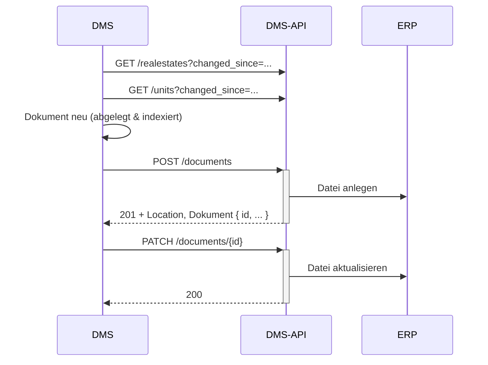

# Dokument importieren (DMS → ERP)

Ziel: Ein Dokument, das in Ihrem DMS liegt, wird im E-Dossier des ERP verlinkt. Es werden nur Metadaten
übertragen – nicht der Dateiinhalt. Beispiel: eine eingescannte Kreditorenrechnung oder -gutschrift, eine
E-Rechnung.

## Voraussetzungen

- Ein gültiges Token mit Scope `wwimmo:dms:api` – siehe
  [Authentifizierung](../3-referenz/1-authentifizierung.md).
- Das Dokument ist bereits in Ihrem DMS abgelegt und indexiert.

## Schritte

1. **Benötigte Stammdaten aktualisieren** (abrufen, nicht annehmen, dass sie aktuell sind):

   ```
   GET /realestates?changed_since=<letzter-abgleich>
   GET /units?changed_since=<letzter-abgleich>
   ```

   Die Antworten sind paginiert – dem `next` im `Link`-Header folgen.

2. **Dokument im ERP anlegen** – mit Metadaten und Verknüpfungen, ohne Dateiinhalt:

   ```
   POST /documents
   Content-Type: application/json

   {
     "name": "EKZ Stromrechnung Winter 2026",
     "type": "invoice",
     "mime-type": "application/pdf",
     "extention": ".pdf",
     "filedate": "2026-01-15T10:00:00Z",
     "storageTargets": ["DMS"],
     "dmsReference": { "archive": "<archiv-uuid ihrer anbindung>", "documentId": "<dms-dokument-id>" },
     "links": [
       { "id": "<liegenschaft-uuid>", "entity-type": "realestate" },
       { "id": "<objekt-uuid>", "entity-type": "unit" }
     ]
   }
   ```

   Antwort `201 Created` mit dem angelegten Dokument im Body und `Location: /api/v1/dms/documents/{id}`.
   Die `id` merken – sie ist der Bezug für spätere Änderungen und für den Rechnungsimport. Das ERP verlinkt
   das Dokument im E-Dossier.

   Fehler `400` (Problem-Format) mit sprechendem `detail`, z. B. `Invalid document type: 'rechnung'. Must be
   one of: invoice, credit, correspondence, assurance`, `Invalid storage target: 'cloud'`,
   `Invalid entity type: 'person'`, `Unknown realestate link target(s): …` oder
   `dmsReference.documentId is required when dmsReference is set.`

3. **Dokument aktualisieren**, falls sich etwas ändert (z. B. weitere Verknüpfungen, neuer Name):

   ```
   PATCH /documents/{id}
   ```

   `PATCH` ändert nur die mitgesendeten Eigenschaften. `PUT /documents/{id}` ersetzt das Dokument
   vollständig und leert dabei nicht mitgesendete Eigenschaften – siehe
   [Konventionen](../3-referenz/2-konventionen.md#teilaktualisierung-patch-statt-put).

   Ein nicht mehr benötigtes Dokument lässt sich mit `DELETE /documents/{id}` löschen (`204`). Die Löschung
   ist heute **physisch**: das Dokument taucht danach in keinem Abruf mehr auf – siehe
   [Konventionen → Löschungen](../3-referenz/2-konventionen.md#löschungen).

## Ablauf



## Hinweise

- `links[].entity-type` (gültige Werte, Gross-/Kleinschreibung egal): `realestate`, `house`, `unit`,
  `appliance`, `tenant`, `tenancy`. Die IDs müssen Stammdaten **Ihres Mandanten** sein, sonst `400`.
- `type` (gültige Werte, Gross-/Kleinschreibung egal): `invoice`, `credit`, `correspondence`, `assurance`.
- `storageTargets` (gültige Werte, Gross-/Kleinschreibung egal): `DMS`, `ERP`.
- `dmsReference` ist beim Import optional; wenn gesetzt, ist `documentId` Pflicht und `archive` muss die
  Archiv-UUID Ihrer Anbindung sein (siehe
  [Konventionen](../3-referenz/2-konventionen.md#teilaktualisierung-patch-statt-put)).
- Ein Retry nach einem Timeout legt ein **zweites** Dokument an – `POST /documents` kennt den
  `Idempotency-Key` von `POST /invoices` noch nicht. Vorher per `GET /documents?changed_since=…` prüfen
  (siehe [Konventionen](../3-referenz/2-konventionen.md#idempotenz)).
- Für Kreditorenrechnungen verwenden Sie stattdessen
  [Rechnung importieren](2-rechnung-importieren.md).
- Ausführbares Beispiel: Bruno-Collection, Ordner *6. Dokumente* (`Dokument erstellen`).
