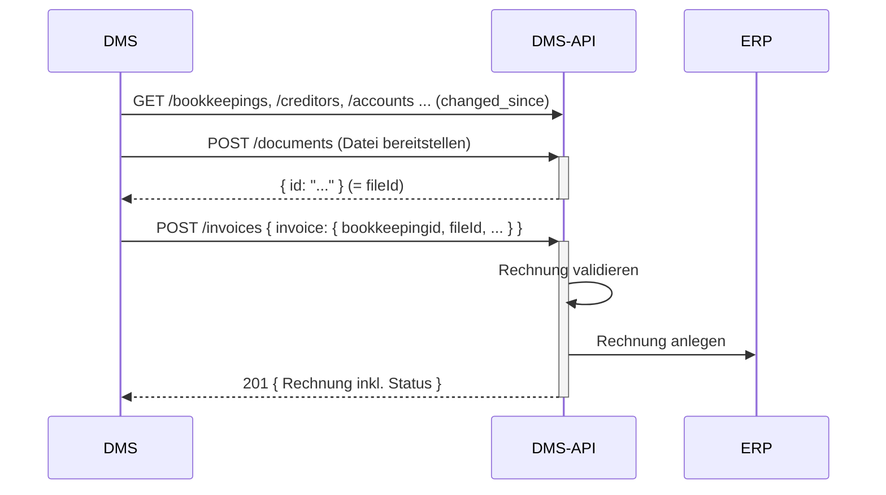

# Rechnung importieren (DMS → ERP)

Ziel: Eine Rechnung aus Ihrem DMS wird ins ERP importiert (zur Verbuchung). Der Freigabe-/Visumsprozess
läuft im DMS und ist **nicht Teil dieser API**.

## Voraussetzungen

- Ein gültiges Token mit Scope `wwimmo:dms:api` – siehe
  [Authentifizierung](../3-referenz/1-authentifizierung.md).
- Das Rechnungsdokument ist im DMS abgelegt und indexiert.
- Die referenzierten Stammdaten (Kreditor, Konto, Buchhaltung) sind synchron.

## Schritte

1. **Buchhaltungs-Stammdaten aktualisieren** (für korrekte Kontierung und Zuordnung):

   ```
   GET /bookkeepings?changed_since=...&changed_until=...
   GET /creditors?changed_since=...&changed_until=...
   GET /accounts?changed_since=...&changed_until=...
   GET /cost-centers?changed_since=...&changed_until=...
   GET /vat-codes?changed_since=...&changed_until=...
   ```

2. **Dokument bereitstellen.** Die Rechnung verweist auf eine **bereits abgelegte Datei** über deren
   `fileId`. Legen Sie das Dokument zuvor wie unter
   [Dokument importieren](1-dokument-importieren.md) an (`POST /documents`) bzw. archivieren Sie es, und
   merken Sie sich dessen `id`.

3. **Rechnung importieren.** Senden Sie die Rechnung im KrediFlow-Format an `POST /invoices`. Die API
   validiert sie und legt sie im ERP an. Die Antwort enthält die angelegte Rechnung inkl.
   Status; bei Validierungsfehlern antwortet die API mit `400` und Details.

   Den genauen Request-Aufbau (`InvoiceUploadRequest` mit `bookkeepingid`-Anker, `fileId`-Bezug,
   `creditor`, `paymentinfo`, `accountings`) finden Sie in der
   [OpenAPI-Spezifikation](../../openapi/dms-api.v1.yaml) — dort bleibt er stets aktuell.

   Eine übergebene Rechnung lässt sich über die API **nicht** zurücknehmen – es gibt keinen Storno.
   Prüfen Sie die Daten deshalb vor dem `POST`; eine Korrektur ist danach nur im ERP möglich.

## Ablauf



## Das Rechnungs-Datenmodell

Rechnungen hängen an der **Buchhaltung** (`bookkeepingid`) und tragen Kreditor, Zahlinformationen,
Buchungszeilen (`accountings`) und einen Datei-Bezug (`fileId` auf ein bereits abgelegtes Dokument). Die
vollständigen Strukturen (`InvoiceUploadRequest`, `InvoiceData`, `InvoiceAccountingData`, …) stehen in der
[OpenAPI-Spezifikation](../../openapi/dms-api.v1.yaml); die fachliche Einordnung im
[Domänenmodell](../4-konzepte/1-domaenenmodell.md#buchhaltungs-entitäten).
