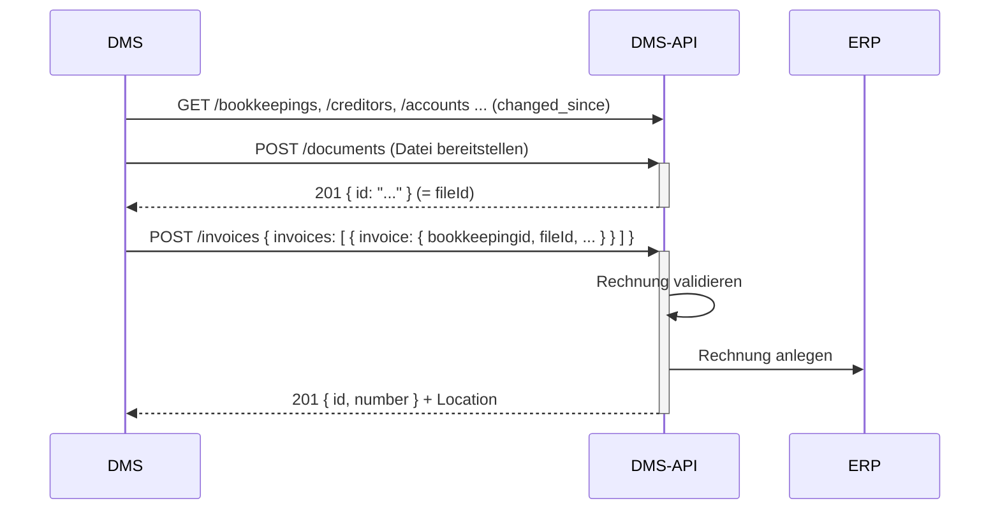

# Rechnung importieren (DMS → ERP)

Ziel: Eine Rechnung aus Ihrem DMS wird ins ERP importiert (zur Verbuchung). Der Freigabe-/Visumsprozess
läuft im DMS und ist **nicht Teil dieser API**.

## Voraussetzungen

- Ein gültiges Token mit Scope `wwimmo:dms:api` – siehe
  [Authentifizierung](../3-referenz/1-authentifizierung.md).
- Das Rechnungsdokument ist im DMS abgelegt und indexiert.
- Die referenzierten Stammdaten (Kreditor, Konto, Buchhaltung) sind synchron.

## Schritte

1. **Buchhaltungs-Stammdaten aktualisieren** (für korrekte Kontierung und Zuordnung):

   ```
   GET /bookkeepings?changed_since=...
   GET /creditors?changed_since=...
   GET /accounts?changed_since=...
   GET /cost-centers?changed_since=...
   GET /vat-codes?changed_since=...
   ```

   `accounts`, `cost-centers` und `vat-codes` liefern unabhängig vom Zeitfenster immer den vollen Bestand
   (ihre ERP-Quelle kennt keine Änderungsstempel) – seltener abrufen und lokal vergleichen.

2. **Dokument bereitstellen.** Die Rechnung verweist auf eine **bereits abgelegte Datei** über deren
   `fileId`. Legen Sie das Dokument zuvor wie unter
   [Dokument importieren](1-dokument-importieren.md) an (`POST /documents`) und merken Sie sich dessen
   `id`.

3. **Rechnung importieren.** Senden Sie die Rechnung an `POST /invoices`. Die API validiert sie und legt
   sie im ERP an.

   ```
   POST /invoices
   Content-Type: application/json

   { "invoices": [ { "invoice": { … } } ] }
   ```

   Die Hülle `invoices[].invoice` ist Teil des Vertrags; verarbeitet wird genau **eine** Rechnung pro
   Aufruf. Pflicht sind `bookkeepingid`, `fileId`, `type` (`Invoice` oder `Credit`), `date`
   (`YYYY-MM-DD`), `amount` und `invoicenumber`. `creditor` entweder mit `id` eines bekannten Kreditors
   oder mit Adressfeldern. Optional: `duedate`, `paymentinfo`, `accountings[]`, `dmsReference` (gleiche
   Regeln wie bei Dokumenten).

   Die vollständigen Felder stehen im Request-Schema von `POST /invoices` in der
   [OpenAPI-Spezifikation](../../openapi/dms-api.v1.yaml) – dort bleiben sie aktuell. Ein ausführbares,
   gegen dieses Schema geprüftes Beispiel ist die Anfrage *Rechnung erstellen* in der
   [Bruno-Collection](../../bruno/README.md).

   Antwort `201 Created` mit `{ "id": "<uuid>", "number": <laufnummer|null> }` und
   `Location: /api/v1/dms/invoices/{id}`. Die vollständige Rechnung lesen Sie mit `GET /invoices/{id}`.

   Bei Fehlern antwortet die API mit `400` in **zwei Formen**: der fachlichen Validierungsliste
   `{ "isValid": false, "errors": [ { field, code, message } ] }` oder – bei strukturellen Fehlern wie einem
   leeren `invoices`-Array – im Problem-Format. Siehe [Fehlerbehandlung](../3-referenz/3-fehler.md).

   Welche Kontierungsregeln gelten (z. B. Kostenstellenpflicht), bestimmt der `erp`-Claim Ihres Tokens
   (`it2` oder `rimo`); ohne Claim gelten die ImmoTop2-Regeln.

   Eine übergebene Rechnung lässt sich über die API **nicht** zurücknehmen – es gibt keinen Storno
   (`DELETE /invoices/{uuid}` antwortet `405`). Prüfen Sie die Daten deshalb vor dem `POST`; eine Korrektur
   ist danach nur im ERP möglich.

## Ablauf



## Das Rechnungs-Datenmodell

Rechnungen hängen an der **Buchhaltung** (`bookkeepingid`) und tragen Kreditor, Zahlinformationen,
Buchungszeilen (`accountings`), einen Datei-Bezug (`fileId` auf ein bereits abgelegtes Dokument) und
optional die Archiv-Referenz (`dmsReference`). Die vollständigen Strukturen stehen in der
[OpenAPI-Spezifikation](../../openapi/dms-api.v1.yaml) (Request-Schema von `POST /invoices`, Antwort von
`GET /invoices/{uuid}`); die fachliche Einordnung im
[Domänenmodell](../4-konzepte/1-domaenenmodell.md#buchhaltungs-entitäten).
