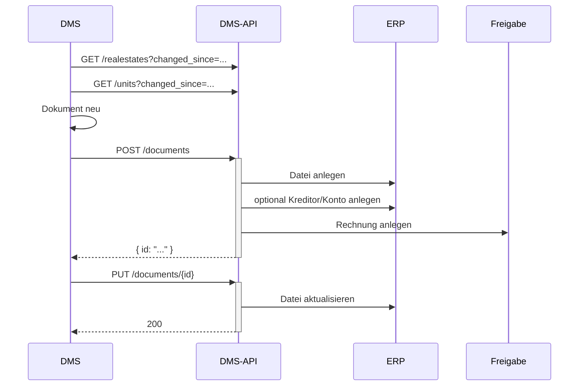

# Rechnung importieren (DMS → ERP → Freigabe)

Ziel: Eine Rechnung aus Ihrem DMS wird ins ERP importiert **und** in den Freigabeprozess übergeben. Das
ist der Dokumentimport plus die Rechnungsverarbeitung.

## Voraussetzungen

- Ein gültiges Token mit Scope `wwimmo:dms:api` – siehe
  [Authentifizierung](../3-referenz/1-authentifizierung.md).
- Das Rechnungsdokument ist im DMS abgelegt und indexiert.
- Die referenzierten Stammdaten (Kreditor, Konto, Buchhaltung) sind synchron.

## Schritte

1. **Stammdaten aktualisieren**, inklusive Rechnungs-Stammdaten:

   ```
   GET /realestates?changed_since=...&changed_until=...
   GET /units?changed_since=...&changed_until=...
   GET /creditors?changed_since=...        (noch nicht in der Spezifikation)
   ```

2. **Dokument anlegen.** Das ERP legt daraus die Rechnung an und übergibt sie dem Freigabeprozess. Bei
   Bedarf werden Kreditor/Konto angelegt:

   ```
   POST /documents   → Datei anlegen
                     → optional Kreditor/Konto anlegen
                     → Rechnung im Freigabeprozess anlegen
   ```

3. **Aktualisieren** Sie das Dokument danach (`PUT /documents/{id}`), falls sich Metadaten oder die
   DMS-Referenz ändern.

## Ablauf



## Das Rechnungs-Datenmodell

Rechnungen hängen an der **Buchhaltung** (`bookkeepingid`) und tragen Kreditor, Zahlinformationen,
Buchungszeilen und einen Workflow-Bezug. Die vollständigen Strukturen `invoices` und `accountings` stehen
im [Domänenmodell](../4-konzepte/1-domaenenmodell.md#buchhaltungs-entitäten).

## Stand

- Die Rechnungs-/Stammdaten-Endpunkte (`/creditors`, `/accounts`, `/invoices`, MWST-Codes, Kostenstellen)
  sind **noch nicht in der OpenAPI-Spezifikation** enthalten – dieser Ablauf ist derzeit konzeptionell
  beschrieben und wird ergänzt.
