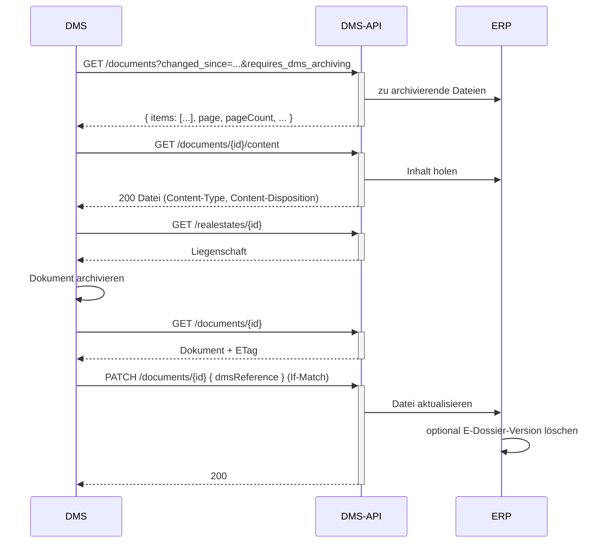

# Dokument archivieren (ERP → DMS)

Ziel: Ein im ERP erzeugtes Dokument wird in Ihr DMS geholt, archiviert und die Archiv-Referenz
zurückgeschrieben. Beispiel: Buchungsbelege zu manuellen Buchungen, Mahnbriefe aus dem Mahnlauf.

## Voraussetzungen

- Ein gültiges Token mit Scope `wwimmo:dms:api` – siehe
  [Authentifizierung](../3-referenz/1-authentifizierung.md).
- Die Archiv-ID Ihrer DMS-Anbindung (`dmsReference.archive`, eine beim Onboarding vergebene UUID).

## Schritte

1. **Dokumente finden, die das ERP zur Archivierung vorsieht:**

   ```
   GET /documents?changed_since=<letzter-abgleich>&requires_dms_archiving
   ```

   `requires_dms_archiving` ist ein Flag ohne Wert: nur Dokumente mit `DMS` in `storageTargets` und ohne
   `dmsReference`. Die Antwort ist paginiert – dem `next` im `Link`-Header folgen.

2. **Dateiinhalt je Dokument abrufen:**

   ```
   GET /documents/{id}/content
   ```

   Antwort `200` mit `Content-Type` = MIME-Typ des Dokuments (z. B. `application/pdf`) und
   `Content-Disposition: attachment; filename="…"`. Es gibt keine Weiterleitung.

3. **Benötigte Stammdaten abrufen**, um korrekt abzulegen, z. B.:

   ```
   GET /realestates/{id}
   GET /tenancies/{id}
   ```

4. **Aktuellen Stand des Dokuments lesen** (optional, für `If-Match`):

   ```
   GET /documents/{id}
   ```

   Der `ETag`-Header dieser Antwort ist der Stand, den Sie im nächsten Schritt schützen.

5. **In Ihrem DMS archivieren**, dann die **Archiv-Referenz zurückschreiben**, damit das ERP die
   Archivierung kennt:

   ```
   PATCH /documents/{id}
   Content-Type: application/json
   If-Match: "<etag aus schritt 4>"

   {
     "dmsReference": { "archive": "<archiv-uuid ihrer anbindung>", "documentId": "<dms-dokument-id>" }
   }
   ```

   `PATCH` ist eine **Teilaktualisierung**: nicht mitgesendete Eigenschaften (`links`, `storageTargets`)
   bleiben unverändert. Antwort `200` mit dem aktualisierten Dokument; `400`, wenn `documentId` fehlt oder
   `archive` nicht Ihre Archiv-UUID ist; `412`, wenn das Dokument seit Schritt 4 geändert wurde. Danach
   erscheint das Dokument nicht mehr in der Liste aus Schritt 1.

   > **Nicht `PUT` verwenden.** `PUT` ersetzt das Dokument vollständig, nicht mitgesendete Eigenschaften
   > werden geleert. Ein `PUT` mit nur `dmsReference` löscht damit die `links` des Dokuments
   > (Liegenschaft, Mietverhältnis …). Siehe
   > [Konventionen → Teilaktualisierung](../3-referenz/2-konventionen.md#teilaktualisierung-patch-statt-put).

   Das ERP kann seine E-Dossier-Kopie anschliessend optional entfernen (das Dokument liegt dann nur im DMS
   oder in beiden Systemen).

## Ablauf



## Hinweise

- `storageTargets` drückt aus, wo die Datei liegt: `["DMS"]` (nur DMS) oder `["DMS","ERP"]` (beide).
  Beim Zurückschreiben der Referenz müssen Sie es nicht mitsenden.
- Ob das ERP seine E-Dossier-Kopie löscht, ist optional.
- Ein abgebrochener Archivierungslauf darf nichts doppeln: `If-Match` schützt vor konkurrierenden
  Schreibzugriffen (`412` statt Überschreiben). Siehe
  [Konventionen → Schreiben mit If-Match](../3-referenz/2-konventionen.md#schreiben-mit-if-match).
- Ausführbare Beispiele: Bruno-Collection, Ordner *6. Dokumente* (`Zu archivierende Dokumente`,
  `Dokumentinhalt herunterladen`, `Archiv-Referenz zurueckschreiben`).
