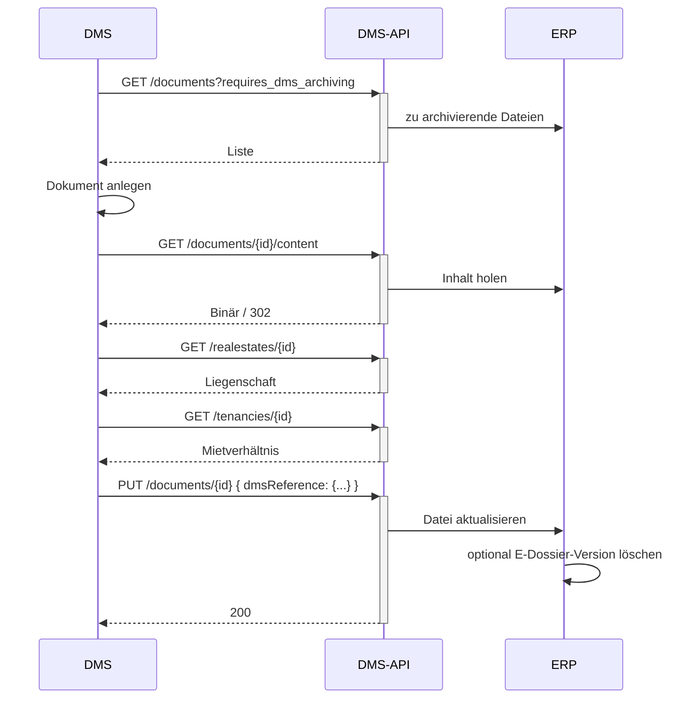

# Dokument archivieren (ERP → DMS)

Ziel: Ein im ERP erzeugtes Dokument wird in Ihr DMS geholt, archiviert und die Archiv-Referenz
zurückgeschrieben. Beispiel: Buchungsbelege zu manuellen Buchungen, Mahnbriefe aus dem Mahnlauf.

## Voraussetzungen

- Ein gültiges Token mit Scope `wwimmo:dms:api` – siehe
  [Authentifizierung](../3-referenz/1-authentifizierung.md).

## Schritte

1. **Dokumente finden, die das ERP zur Archivierung vorsieht:**

   ```
   GET /documents?changed_since=<letzter-abgleich>&requires_dms_archiving
   ```
   `requires_dms_archiving` ist ein Flag-Filter: nur Dokumente, die durch das DMS archiviert werden sollen.

2. **Dateiinhalt je Dokument abrufen:**

   ```
   GET /documents/{id}/content
   ```
   Liefert den Binärstrom (`application/octet-stream`) oder eine `302`-Weiterleitung, wenn die Datei auf
   einem CDN liegt – der Weiterleitung folgen.

3. **Benötigte Stammdaten abrufen**, um korrekt abzulegen, z. B.:

   ```
   GET /realestates/{id}
   GET /tenancies/{id}
   ```

4. **In Ihrem DMS archivieren**, dann die **Archiv-Referenz zurückschreiben**, damit das ERP die
   Archivierung kennt:

   ```
   PUT /documents/{id}
   Content-Type: application/json

   {
     "dmsReference": { "archive": "<archiv-id>", "documentId": "<dms-dokument-id>" },
     "storageTargets": ["DMS", "ERP"]
   }
   ```
   Das ERP kann seine E-Dossier-Kopie anschliessend optional entfernen (das Dokument liegt dann nur im DMS
   oder in beiden Systemen).

## Ablauf



## Hinweise

- `storageTargets` drückt nach der Archivierung aus, wo die Datei liegt: `["DMS"]` (nur DMS) oder
  `["DMS","ERP"]` (beide).
- Ob das ERP seine E-Dossier-Kopie löscht, ist optional.
