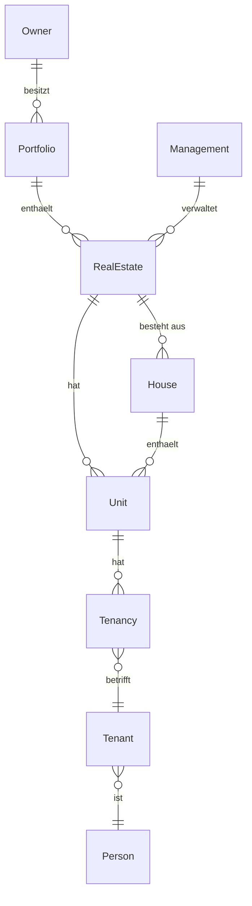

# Domänenmodell

Die fachliche Landkarte: was die Entitäten *bedeuten*, wie sie *zusammenhängen* und welchen Lebenszyklus
sie haben. Feldtypen stehen in der [OpenAPI-Spezifikation](../../openapi/README.md).

## Fachmodell statt ERP-Interna

Die API stellt ein **eigenständiges Fachmodell** bereit und ist von den Interna der ERP-Systeme
entkoppelt. Wichtigste Konsequenzen für Sie:

- Buchhaltungsbezogene Strukturen (Konten, MWST-Codes, Buchungshistorie, Rechnungen) hängen an der
  **Buchhaltung** (`bookkeepingid`).
- Liegenschaften werden über **`portfolioid`** gruppiert.
- Am Endpunkt sind `portfolioid` und `bookkeepingid` **nicht null**.

So programmieren Sie gegen ein stabiles Modell, unabhängig davon, ob im Hintergrund Rimo R5 oder ImmoTop2
läuft.

## Stammdaten

Die stabilen Bezugsobjekte. Eine Zeile je Entität – vollständige Attribute in der Spezifikation und im
Wiki.

| Entität | Bedeutung |
| --- | --- |
| **Portfolio** | Verwaltete Zusammenfassung mehrerer Liegenschaften eines Eigentümers. |
| **Eigentümer** (Owner) | Rechtlich verantwortliche Partei; trägt Ertrag und Kosten; erteilt den Bewirtschaftungsauftrag. |
| **Verwaltung** (Management) | Organisation, die die Liegenschaften bewirtschaftet. |
| **Liegenschaft** (RealEstate) | Rechtlich/wirtschaftlich abgegrenzte Immobilieneinheit; Basis aller Bewirtschaftungsprozesse. Gehört zu genau einem Portfolio. |
| **Haus** (House) | Physisches Gebäude innerhalb einer Liegenschaft; enthält Objekte. |
| **Objekt** (Unit) | Kleinste abrechenbare Mieteinheit. Gehört zu genau einer Liegenschaft (bei Wohnungen zusätzlich zu einem Haus). |
| **Gerät** (Appliance) | Wartbares Gerät, einer Liegenschaft/einem Objekt zugeordnet. |
| **Mietverhältnis** (Tenancy) | Verbindet ein Objekt mit einem Mieter über die Zeit. |
| **Mieter** (Tenant) | Mietende Partei (verweist auf eine Person). |
| **Person** (Person) | Natürliche/juristische Person; Kontakt-Wurzel hinter Eigentümern, Mietern usw. |

### Beziehungen



- Ein **Portfolio** hat mehrere **Liegenschaften**; jede Liegenschaft gehört zu genau einem Portfolio und
  wird von genau einer **Verwaltung** bewirtschaftet.
- Eine **Liegenschaft** besteht aus einem oder mehreren **Häusern** und **Objekten**.
- Ein **Mietverhältnis** verbindet ein **Objekt** mit einem **Mieter**; ein Mieter verweist auf eine
  **Person**.

## Buchhaltungs-Entitäten

Werden vom Rechnungsimport genutzt. Am Endpunkt hängen sie an der **Buchhaltung** (`bookkeepingid`).

| Entität | Bedeutung |
| --- | --- |
| **Buchhaltung** (Bookkeeping) | Abrechnungseinheit; verweist auf ein Portfolio. Anker für Rechnungsdaten. |
| **Kreditor** (Creditor) | Ein Lieferant. Portfolio-/buchhaltungsunabhängig. |
| **Zahlstelle** (PaymentAccount) | Zahlverbindung eines Kreditors (IBAN). |
| **Zahlverbindung Mandant** (PayoutBankAccount) | Auszahlende Verbindung je Buchhaltung. |
| **Konto** (Account) | Ein Buchhaltungskonto. |
| **Kostenstelle** (CostCenter) | Kostenstelle (nur ImmoTop2). |
| **MWST-Code** (VatCode) | Mehrwertsteuercode. |
| **Rechnung** (Invoice) | Rechnung oder Gutschrift, die in den Freigabeprozess läuft. |
| **Kontierung** (Accounting) | Buchungszeile zu einer Rechnung. |
| **Visumspfad** (RealestateVisa) | Freigabe-/Visumspfad. |

> Die Buchhaltungs-Schemas sind heute im Wiki definiert, aber **noch nicht in der OpenAPI-Spezifikation**.
> Solange das so ist, lässt sich der Rechnungsimport nur konzeptionell als Referenz beschreiben.

## Dokumentmodell

Ein **Dokument** (`DocumentEntity`) ist „eine lesbare Datei". Wichtige Felder:

- `id` (uuid), `name`, `filedate`, `mime-type`, `extention`, `url`, `barcode`.
- `type` – einer von `invoice` | `credit` | `correspondence` | `assurance`.
- `storageTargets` – Liste aus `DMS` | `ERP`: wo die Datei physisch liegt.
- `dmsReference` – `{ archive, documentId }`: die Rück-Referenz, sobald das DMS archiviert hat.
- `links` – Liste von `DocumentLinkEntity` `{ id, entity-type }` zur Verknüpfung mit Stammdaten
  (`realestate`, `house`, `unit`, `appliance`, `tenant`, `tenancy`).

### Lebenszyklus (informell)

```
Import:      im DMS erstellt → Metadaten an ERP (POST) → im E-Dossier verlinkt
Archivierung: im ERP erstellt → vom DMS geholt → im DMS archiviert
              → dmsReference zurückgeschrieben (PUT) → optional aus ERP entfernt
```

> Ob Dokumente einen expliziten Status tragen und ob Löschen/Ersetzen/Versionierung unterstützt wird, ist
> noch offen und wird ergänzt.

## Offene Punkte mit Vertragswirkung

Diese Entscheidungen verändern Feldform oder Endpunktstruktur – bitte noch nicht fest darauf
programmieren:

- **MWST-Code „für alle"** – wie der Fall „gilt für alle Buchhaltungen" am Endpunkt abgebildet wird.
- **Scope von `realestatevisas`** – je Liegenschaft, je Buchhaltung oder je Portfolio.
- **Scope via Pfad vs. Payload** – ob `bookkeepingid`/`portfolioid` Payload-Felder oder Pfad-Parameter
  sind (z. B. `GET /bookkeepings/{id}/accounts`).

Begriffsdefinitionen im [Glossar](2-glossar.md).
