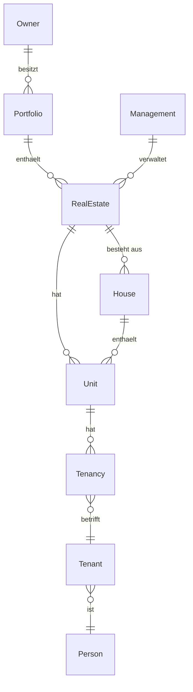

# Domänenmodell

Die fachliche Landkarte: was die Entitäten *bedeuten*, wie sie *zusammenhängen* und welchen Lebenszyklus
sie haben. Feldtypen stehen in der [OpenAPI-Spezifikation](../../openapi/dms-api.v1.yaml).

## Fachmodell statt ERP-Interna

Die API stellt ein **eigenständiges Fachmodell** bereit und ist von den Interna der ERP-Systeme
entkoppelt. Wichtigste Konsequenzen für Sie:

- Buchhaltungsbezogene Strukturen (Konten, MWST-Codes, Buchungshistorie, Rechnungen) hängen an der
  **Buchhaltung** (`bookkeepingid`).
- Liegenschaften werden über **`portfolioid`** gruppiert.
- Am Endpunkt sind `portfolioid` und `bookkeepingid` **nicht null**.

So programmieren Sie gegen ein stabiles Modell, unabhängig davon, ob im Hintergrund Rimo R5 oder ImmoTop2
läuft.

Die **Buchhaltung** kennt drei Ausprägungen, die implizit über die gesetzten Fremdschlüssel erkennbar
sind: *Portfolio-Modus* (`portfolioid` gesetzt), *Liegenschafts-Modus* (`realestateid` gesetzt) und
*Standalone* (beide leer). Für ImmoTop2 kommt nur der Portfolio-Modus zum Tragen.

## Stammdaten

Die stabilen Bezugsobjekte. Eine Zeile je Entität – vollständige Attribute in der Spezifikation.

| Entität | Bedeutung |
| --- | --- |
| **Portfolio** | Verwaltete Zusammenfassung mehrerer Liegenschaften eines Eigentümers. |
| **Eigentümer** (Owner) | Rechtlich verantwortliche Partei; trägt Ertrag und Kosten; erteilt den Bewirtschaftungsauftrag. Kein eigener Endpunkt – über `Portfolio.ownerid` referenziert. |
| **Verwaltung** (Management) | Organisation, die die Liegenschaften bewirtschaftet. Kein eigener Endpunkt – über `RealEstate.managementid` referenziert. |
| **Liegenschaft** (RealEstate) | Rechtlich/wirtschaftlich abgegrenzte Immobilieneinheit; Basis aller Bewirtschaftungsprozesse. Gehört zu genau einem Portfolio. |
| **Haus** (House) | Physisches Gebäude innerhalb einer Liegenschaft; enthält Objekte. |
| **Objekt** (Unit) | Kleinste abrechenbare Mieteinheit. Gehört zu genau einer Liegenschaft (bei Wohnungen zusätzlich zu einem Haus). |
| **Gerät** (Appliance) | Wartbares Gerät, einer Liegenschaft/einem Objekt zugeordnet. |
| **Mietverhältnis** (Tenancy) | Verbindet ein Objekt mit einem Mieter über die Zeit. |
| **Mieter** (Tenant) | Mietende Partei (verweist auf eine Person). |
| **Person** (Person) | Natürliche/juristische Person; Kontakt-Wurzel hinter Eigentümern, Mietern usw. |

### Beziehungen



- Ein **Portfolio** hat mehrere **Liegenschaften**; jede Liegenschaft gehört zu genau einem Portfolio und
  wird von genau einer **Verwaltung** bewirtschaftet.
- Eine **Liegenschaft** besteht aus einem oder mehreren **Häusern** und **Objekten**.
- Ein **Mietverhältnis** verbindet ein **Objekt** mit einem **Mieter**; ein Mieter verweist auf eine
  **Person**.

## Buchhaltungs-Entitäten

Werden vom Rechnungsimport genutzt. Am Endpunkt hängen sie an der **Buchhaltung** (`bookkeepingid`).

| Entität | Bedeutung |
| --- | --- |
| **Buchhaltung** (Bookkeeping) | Abrechnungseinheit; Anker für Rechnungsdaten. Drei Modi (Portfolio/Liegenschaft/Standalone, siehe oben). In der Bruno-Collection «Buchungskreis» genannt. |
| **Kreditor** (Creditor) | Ein Lieferant. Portfolio-/buchhaltungsunabhängig. |
| **Zahlstelle** (PaymentAccount) | Zahlverbindung eines Kreditors (IBAN). |
| **Auszahlverbindung** (PayoutBankAccount) | Auszahlende Bankverbindung ohne Liegenschaftsbezug. |
| **Auszahlverbindung↔Buchhaltung** (PayoutBankAccountBookkeeping) | M:N-Verknüpfung; ein `default`-Flag je Verknüpfung markiert die Standard-Verbindung der Buchhaltung. |
| **Konto** (Account) | Ein Buchhaltungskonto. Flags wie `requirescostcenter`, `vatconfig`, `extracostdate` steuern die Validierung von Kontierungen. |
| **Kostenstelle** (CostCenter) | Kostenstelle (nur ImmoTop2). |
| **Konto-Kostenstelle** (AccountCostCenter) | Zuweisung von Konten zu Kostenstellen. |
| **Buchungshistorie** (AccountingHistory) | Kontierungshistorie (frühere Buchungszeilen). |
| **MWST-Code** (VatCode) | Mehrwertsteuercode. |
| **Rechnung** (Invoice) | Kreditorenrechnung oder Gutschrift; trägt optional `dmsReference` auf das archivierte Dokument. |
| **Kontierung** (Accounting) | Buchungszeile zu einer Rechnung. |

Diese Entitäten sind in der [OpenAPI-Spezifikation](../../openapi/dms-api.v1.yaml) als `GET`-Endpunkte
abgebildet (paginiert, mit `changed_since` + `changed_until`); `creditors`, `accounts` und `invoices`
bieten zusätzlich `POST`. Die Listen `accounts`, `account-cost-centers`, `cost-centers`, `vat-codes`,
`payment-accounts`, `payout-bank-accounts` und `accountings-history` akzeptieren das Zeitfenster, wenden es
aber nicht an (ihre ERP-Quelle kennt keine Änderungsstempel) – sie liefern immer den vollen Bestand.

## Personen & Rollen

Wer mit Liegenschaften und Mietverhältnissen zu tun hat. Alle als paginierte `GET`-Endpunkte.

| Entität | Bedeutung |
| --- | --- |
| **Person** (Person) | Natürliche/juristische Person; Kontakt-Wurzel hinter Mietern, Kreditoren usw. Adressfelder spiegeln die jüngste Adresse. |
| **Liegenschaftsperson** (RealestatePerson) | Person ↔ Liegenschaft mit Rolle. |
| **Mietverhältnisperson** (TenancyPerson) | Person ↔ Mietverhältnis mit Rolle. |

ERP-Benutzer und Visumspfade sind seit 2026-08-26 nicht mehr Teil der API (siehe
[CHANGELOG](../../CHANGELOG.md)).

## Aufträge

| Entität | Bedeutung |
| --- | --- |
| **Auftrag** (Order) | Arbeitsauftrag aus dem Portal; trägt u. a. Status, Kontakt/Auftragnehmer, Liegenschaftsbezug und mehrsprachige Titel/Anweisungen (`mls`). |

## Dokumentmodell

Ein **Dokument** ist «eine lesbare Datei». Wichtige Felder:

- `id` (uuid), `name`, `filedate`, `mime-type`, `extention`, `url`, `barcode`.
- `type` – einer von `invoice` | `credit` | `correspondence` | `assurance` (Eingabe
  Gross-/Kleinschreibungs-unabhängig, Ausgabe kleingeschrieben).
- `storageTargets` – Liste aus `DMS` | `ERP`: wo die Datei physisch liegt.
- `dmsReference` – `{ archive, documentId }`: die Rück-Referenz, sobald das DMS archiviert hat. `archive`
  ist die Archiv-UUID Ihrer Anbindung, `documentId` Pflicht, wenn das Objekt gesetzt ist.
- `links` – Liste von `{ id, entity-type }` zur Verknüpfung mit Stammdaten Ihres Mandanten
  (`realestate`, `house`, `unit`, `appliance`, `tenant`, `tenancy`).

`GET /documents` ist paginiert, nimmt das Zeitfenster und das Flag `requires_dms_archiving` (= `DMS` in
`storageTargets` **und** `dmsReference` leer: die Archivierungsaufträge).

### Lebenszyklus (informell)

```
Import:       im DMS erstellt → Metadaten an ERP (POST /documents, 201) → im E-Dossier verlinkt
Archivierung: im ERP erstellt → vom DMS geholt (GET …/content) → im DMS archiviert
              → dmsReference zurückgeschrieben (PATCH) → optional aus ERP entfernt (DELETE)
Löschung:     DELETE /documents/{uuid} → heute physisch gelöscht (204), kein Tombstone
```

> Die endgültige Löschsemantik wird mit dem Feedback der ersten Partner festgelegt (siehe
> [Konventionen → Löschungen](../3-referenz/2-konventionen.md#löschungen)). Ob Dokumente einen expliziten
> Status tragen und ob Ersetzen/Versionierung unterstützt wird, ist ebenfalls noch offen.

Begriffsdefinitionen im [Glossar](2-glossar.md).
