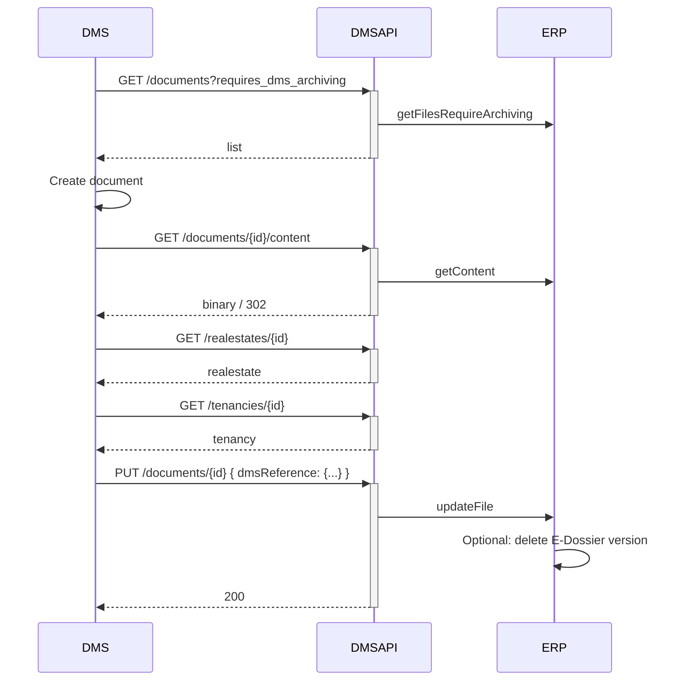

# How to: archive a document (ERP → DMS)

> **How-to.** Task-oriented. Goal: a document created in the ERP is pulled into your DMS, archived, and
> the archive reference written back. Example: booking receipts for manual postings, dunning letters from
> a dunning run.

## Prerequisites

- A valid token with scope `wwimmo:dms:api` — see [authentication](../reference/authentication.md).

## Steps

1. **Find documents the ERP wants archived** by the DMS:

   ```
   GET /documents?changed_since=<last-sync>&requires_dms_archiving
   ```
   `requires_dms_archiving` is a flag filter: return only items intended to be archived by the DMS.

2. **Fetch each document's file content:**

   ```
   GET /documents/{id}/content
   ```
   Returns the binary stream (`application/octet-stream`), or a `302` redirect when the file is on a CDN —
   follow the redirect.

3. **Fetch the master data** you need to file it correctly, e.g.:

   ```
   GET /realestates/{id}
   GET /tenancies/{id}
   ```

4. **Archive in your DMS**, then **write the archive reference back** so the ERP knows it's archived:

   ```
   PUT /documents/{id}
   Content-Type: application/json

   {
     "dmsReference": { "archive": "<archive-id>", "documentId": "<dms-doc-id>" },
     "storageTargets": ["DMS", "ERP"]
   }
   ```
   The ERP may then optionally remove its own E-Dossier copy (so the document ends up only in the DMS, or
   in both).

## Reference flow



## Notes & gaps

- `storageTargets` after archiving expresses where the file lives: `["DMS"]` (DMS only) or
  `["DMS","ERP"]` (both).
- 🚧 Whether the ERP deletes its E-Dossier copy is "optional" in the design — confirm the trigger/contract.
- 🚧 The `dmsReference` field lengths/format and whether `archive`/`documentId` are both required.
