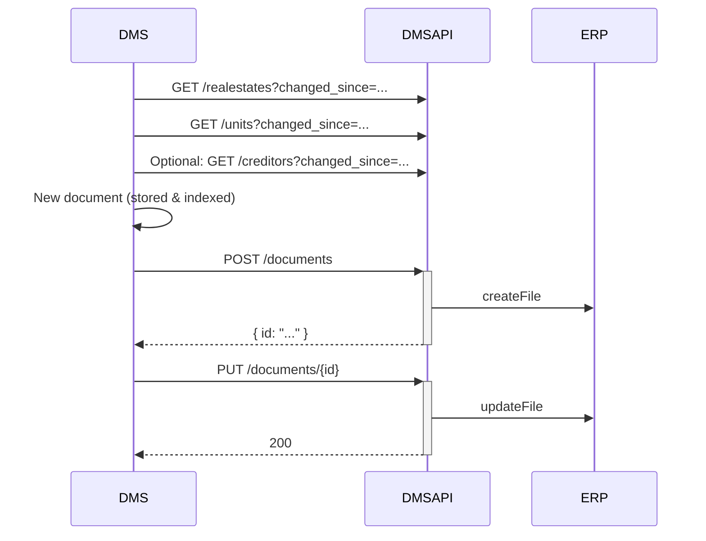

# How to: import a document (DMS → ERP)

> **How-to.** Task-oriented. Goal: a document that exists in your DMS becomes linked in the ERP's
> E-Dossier. Only metadata moves to the ERP — not the file content. Example: a scanned creditor invoice
> or credit, an e-bill.

## Prerequisites

- A valid token with scope `wwimmo:dms:api` — see [authentication](../reference/authentication.md).
- The document already stored and indexed in your DMS.

## Steps

1. **Refresh the master data you need to link against** (poll, don't assume it's current):

   ```
   GET /realestates?changed_since=<last-sync>&changed_until=<now>
   GET /units?changed_since=<last-sync>&changed_until=<now>
   ```
   Optionally `GET /creditors?changed_since=...` if you'll attach the document to a creditor.

2. **Create the document in the ERP** with metadata and links (no file content):

   ```
   POST /documents
   Content-Type: application/json

   {
     "name": "EKZ Stromrechnung Winter 2026",
     "type": "invoice",
     "mime-type": "application/pdf",
     "extention": ".pdf",
     "filedate": "2026-01-15T10:00:00Z",
     "storageTargets": ["DMS"],
     "links": [
       { "id": "<realestate-uuid>", "entity-type": "realeestate" },
       { "id": "<unit-uuid>", "entity-type": "unit" }
     ]
   }
   ```
   The response returns the created `DocumentEntity` including its `id`. The ERP links it in the E-Dossier.

3. **Update the document if anything changes** (e.g. additional links, a new name):

   ```
   PUT /documents/{id}
   ```

## Reference flow



## Notes & gaps

- `links[].entity-type` enum in the current spec: `realeestate`, `houses`, `units`, `appliance`,
  `tenant`, `tenancy`. (Note the spelling `realeestate` in the draft spec.)
- 🚧 The exact **required vs optional fields** on `POST /documents` aren't fully constrained in the spec yet.
- For invoices that must run through approval, use [import an invoice](import-an-invoice.md) instead.
