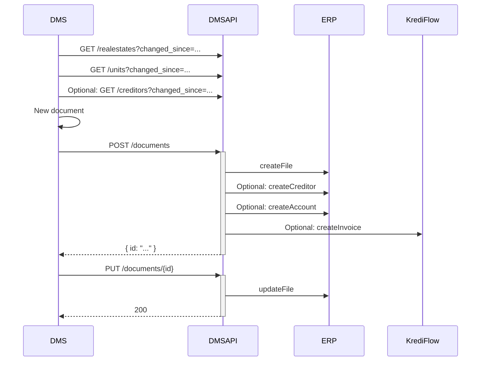

# How to: import an invoice (DMS → ERP → KrediFlow)

> **How-to.** Task-oriented. Goal: an invoice stored in your DMS is imported into the ERP **and** enters
> the KrediFlow approval workflow. This is the document-import flow plus invoice processing.

## Prerequisites

- A valid token with scope `wwimmo:dms:api` — see [authentication](../reference/authentication.md).
- The invoice document stored and indexed in your DMS.
- The accounting master data you reference (creditor, account, bookkeeping) is in sync.

## Steps

1. **Refresh master data**, including accounting entities:

   ```
   GET /realestates?changed_since=...&changed_until=...
   GET /units?changed_since=...&changed_until=...
   GET /creditors?changed_since=...        # 🚧 not yet in the spec
   ```

2. **Create the document**, then have the ERP create the invoice and feed KrediFlow. In the current
   design this is a `POST /documents` whose downstream effect is creating the creditor/account if needed
   and an invoice in KrediFlow:

   ```
   POST /documents          → DMSAPI: createFile
                            → ERP:    optional createCreditor / createAccount
                            → KrediFlow: createInvoice
   ```

3. **Update** the document afterwards (`PUT /documents/{id}`) if metadata or the DMS reference changes.

## Reference flow



## The invoice data model

Invoices key on **`bookkeepingid`** (not `realestateid`) and carry creditor, payment, accounting lines,
and a workflow instance. The full `invoices` and `accountings` structures are in the
[domain model](../explanation/domain-model.md#accounting-entities-cred) and the
[Endpoint-Struktur wiki](https://dev.azure.com/wwimmo-mobile/mobile/_wiki/wikis/mobile.wiki/2476/Endpoint-Struktur-(Portfolio-Bookkeeping)).

## Gaps blocking a complete guide

- 🚧 **Accounting endpoints/schemas are not in the OpenAPI spec yet** (gap #8): `/creditors`,
  `/accounts`, `/invoices`, vatcodes, cost centers. Today this flow can only be described conceptually.
- 🚧 **`PUT /invoices`** and related invoice operations are on the API-gap list (per domain work).
- 🚧 **Visa / approval path** (`realestatevisas`) scope is an open domain decision — see
  [domain model](../explanation/domain-model.md#open-domain-decisions-that-affect-the-contract).
